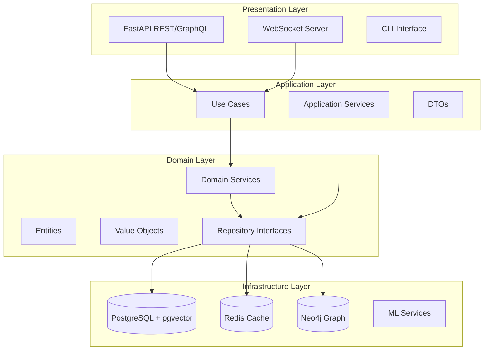

# Phase 4: Production & Optimization Implementation Guide

## 📋 Objetivo de la Fase

Preparar el sistema para producción con optimizaciones de performance, infraestructura robusta con Kubernetes, monitoreo completo, CI/CD pipelines, y documentación exhaustiva.

## 🎯 Entregables Clave

1. Optimización de performance (caching, batching, async)
2. Infraestructura Kubernetes con Helm charts
3. CI/CD pipeline completo con GitHub Actions
4. Stack de monitoreo (Prometheus, Grafana, OpenTelemetry)
5. Security hardening y compliance
6. Documentación completa y benchmarks
7. Load testing y performance tuning

## 📅 Timeline Detallado

### Semana 19-20: Performance Optimization

#### Día 1-3: Caching Strategy Implementation

```python
# src/infrastructure/caching/redis_cache.py
import hashlib
import json
from typing import Optional, Any
import redis.asyncio as redis
from functools import wraps

class RedisCache:
    def __init__(self, redis_client: redis.Redis, default_ttl: int = 3600):
        self.client = redis_client
        self.default_ttl = default_ttl
    
    async def get(self, key: str) -> Optional[Any]:
        value = await self.client.get(key)
        if value:
            return json.loads(value)
        return None
    
    async def set(self, key: str, value: Any, ttl: Optional[int] = None):
        ttl = ttl or self.default_ttl
        await self.client.setex(
            key, 
            ttl, 
            json.dumps(value, default=str)
        )
    
    async def invalidate_pattern(self, pattern: str):
        """Invalidar todas las keys que coincidan con el patrón"""
        keys = await self.client.keys(pattern)
        if keys:
            await self.client.delete(*keys)

# Decorador para caching
def cache_result(ttl: int = 3600, key_prefix: str = ""):
    def decorator(func):
        @wraps(func)
        async def wrapper(self, *args, **kwargs):
            # Generar cache key
            cache_key = f"{key_prefix}:{func.__name__}:{_generate_key(args, kwargs)}"
            
            # Intentar obtener de cache
            cached = await self.cache.get(cache_key)
            if cached is not None:
                return cached
            
            # Ejecutar función
            result = await func(self, *args, **kwargs)
            
            # Guardar en cache
            await self.cache.set(cache_key, result, ttl)
            
            return result
        return wrapper
    return decorator

def _generate_key(args, kwargs) -> str:
    """Generar key única basada en argumentos"""
    key_data = {
        "args": args,
        "kwargs": kwargs
    }
    return hashlib.md5(
        json.dumps(key_data, sort_keys=True, default=str).encode()
    ).hexdigest()

# Implementación de caching multicapa
class MultiLayerCache:
    def __init__(self, 
                 local_cache: dict,
                 redis_cache: RedisCache,
                 local_ttl: int = 300):
        self.local_cache = local_cache
        self.redis_cache = redis_cache
        self.local_ttl = local_ttl
    
    async def get(self, key: str) -> Optional[Any]:
        # 1. Check local cache
        if key in self.local_cache:
            return self.local_cache[key]["value"]
        
        # 2. Check Redis
        value = await self.redis_cache.get(key)
        if value:
            # Populate local cache
            self.local_cache[key] = {
                "value": value,
                "expires": time.time() + self.local_ttl
            }
            return value
        
        return None
```

#### Día 4-6: Query Optimization & Batching

```python
# src/application/services/batch_processor.py
from typing import List, Dict, Any
import asyncio
from collections import defaultdict

class BatchProcessor:
    def __init__(self, 
                 embedding_service: EmbeddingService,
                 batch_size: int = 32,
                 max_wait_time: float = 0.1):
        self.embedding_service = embedding_service
        self.batch_size = batch_size
        self.max_wait_time = max_wait_time
        self.pending_requests = defaultdict(list)
        self.processing = False
    
    async def process_embedding_batch(self, texts: List[str]) -> List[Embedding]:
        """Procesar embeddings en batch para eficiencia"""
        # Añadir a cola
        request_id = str(uuid4())
        future = asyncio.Future()
        
        for i, text in enumerate(texts):
            self.pending_requests[request_id].append({
                "text": text,
                "index": i,
                "future": future
            })
        
        # Trigger processing si no está activo
        if not self.processing:
            asyncio.create_task(self._process_batches())
        
        # Esperar resultado
        results = await future
        return results
    
    async def _process_batches(self):
        self.processing = True
        
        while self.pending_requests:
            # Recolectar batch
            batch_texts = []
            batch_futures = []
            
            for request_id, requests in list(self.pending_requests.items()):
                for req in requests[:self.batch_size - len(batch_texts)]:
                    batch_texts.append(req["text"])
                    batch_futures.append((req["future"], req["index"]))
                
                if len(batch_texts) >= self.batch_size:
                    break
            
            if batch_texts:
                # Procesar batch
                try:
                    embeddings = await self.embedding_service.embed_batch(batch_texts)
                    
                    # Resolver futures
                    results_by_future = defaultdict(list)
                    for (future, index), embedding in zip(batch_futures, embeddings):
                        results_by_future[future].append((index, embedding))
                    
                    for future, results in results_by_future.items():
                        # Ordenar por índice original
                        sorted_results = sorted(results, key=lambda x: x[0])
                        future.set_result([r[1] for r in sorted_results])
                        
                except Exception as e:
                    for future, _ in batch_futures:
                        future.set_exception(e)
            
            # Pequeña espera para acumular más requests
            await asyncio.sleep(self.max_wait_time)
        
        self.processing = False

# Optimización de queries SQL
class OptimizedDocumentRepository(PostgreSQLDocumentRepository):
    
    @cache_result(ttl=3600, key_prefix="doc")
    async def get_by_id(self, document_id: UUID) -> Optional[Document]:
        # Usar eager loading para reducir N+1 queries
        result = await self.session.execute(
            select(DocumentModel)
            .options(selectinload(DocumentModel.chunks))
            .where(DocumentModel.id == document_id)
        )
        return self._to_domain(result.scalar_one_or_none())
    
    async def get_batch(self, document_ids: List[UUID]) -> List[Document]:
        # Single query para múltiples documentos
        result = await self.session.execute(
            select(DocumentModel)
            .options(selectinload(DocumentModel.chunks))
            .where(DocumentModel.id.in_(document_ids))
        )
        return [self._to_domain(doc) for doc in result.scalars().all()]
```

#### Día 7-9: Async Optimization & Connection Pooling

```python
# src/infrastructure/connection_pool.py
from contextlib import asynccontextmanager
import asyncio
from typing import Optional

class ConnectionPool:
    def __init__(self, 
                 factory,
                 min_size: int = 10,
                 max_size: int = 100):
        self.factory = factory
        self.min_size = min_size
        self.max_size = max_size
        self.pool = asyncio.Queue(maxsize=max_size)
        self.size = 0
        self._closing = False
    
    async def initialize(self):
        """Pre-crear conexiones mínimas"""
        for _ in range(self.min_size):
            conn = await self.factory()
            await self.pool.put(conn)
            self.size += 1
    
    @asynccontextmanager
    async def acquire(self):
        """Adquirir conexión del pool"""
        conn = None
        try:
            # Intentar obtener del pool
            try:
                conn = self.pool.get_nowait()
            except asyncio.QueueEmpty:
                if self.size < self.max_size:
                    # Crear nueva conexión
                    conn = await self.factory()
                    self.size += 1
                else:
                    # Esperar por conexión disponible
                    conn = await self.pool.get()
            
            yield conn
            
        finally:
            if conn and not self._closing:
                # Devolver al pool
                await self.pool.put(conn)
            elif conn:
                # Cerrar si estamos cerrando el pool
                await conn.close()

# Paralelización de operaciones
class ParallelProcessor:
    def __init__(self, max_concurrent: int = 10):
        self.semaphore = asyncio.Semaphore(max_concurrent)
    
    async def process_documents_parallel(self, 
                                       documents: List[Document],
                                       processor_func) -> List[Any]:
        """Procesar documentos en paralelo con límite de concurrencia"""
        async def process_with_semaphore(doc):
            async with self.semaphore:
                return await processor_func(doc)
        
        tasks = [process_with_semaphore(doc) for doc in documents]
        return await asyncio.gather(*tasks)
```

#### Día 10-12: Load Testing & Performance Tuning

```python
# scripts/load_test.py
import asyncio
import aiohttp
import time
from dataclasses import dataclass
from typing import List
import statistics

@dataclass
class LoadTestResult:
    total_requests: int
    successful_requests: int
    failed_requests: int
    avg_latency_ms: float
    p95_latency_ms: float
    p99_latency_ms: float
    requests_per_second: float

class LoadTester:
    def __init__(self, base_url: str):
        self.base_url = base_url
        self.results = []
    
    async def run_load_test(self,
                          num_requests: int = 1000,
                          concurrent_users: int = 50):
        print(f"Starting load test: {num_requests} requests, {concurrent_users} concurrent users")
        
        semaphore = asyncio.Semaphore(concurrent_users)
        start_time = time.time()
        
        async def make_request(session, request_num):
            async with semaphore:
                request_start = time.time()
                try:
                    # Test query endpoint
                    async with session.post(
                        f"{self.base_url}/api/v1/search",
                        json={
                            "query": f"test query {request_num}",
                            "max_results": 10
                        }
                    ) as response:
                        await response.json()
                        latency = (time.time() - request_start) * 1000
                        return {"success": True, "latency": latency}
                except Exception as e:
                    return {"success": False, "error": str(e)}
        
        async with aiohttp.ClientSession() as session:
            tasks = [make_request(session, i) for i in range(num_requests)]
            results = await asyncio.gather(*tasks)
        
        total_time = time.time() - start_time
        
        # Analizar resultados
        successful = [r for r in results if r.get("success")]
        latencies = [r["latency"] for r in successful]
        
        return LoadTestResult(
            total_requests=num_requests,
            successful_requests=len(successful),
            failed_requests=num_requests - len(successful),
            avg_latency_ms=statistics.mean(latencies) if latencies else 0,
            p95_latency_ms=statistics.quantiles(latencies, n=20)[18] if latencies else 0,
            p99_latency_ms=statistics.quantiles(latencies, n=100)[98] if latencies else 0,
            requests_per_second=num_requests / total_time
        )

# Performance profiling
import cProfile
import pstats
from io import StringIO

def profile_async_function(func):
    """Decorador para perfilar funciones async"""
    async def wrapper(*args, **kwargs):
        profiler = cProfile.Profile()
        profiler.enable()
        
        try:
            result = await func(*args, **kwargs)
        finally:
            profiler.disable()
            
            # Analizar resultados
            s = StringIO()
            ps = pstats.Stats(profiler, stream=s).sort_stats('cumulative')
            ps.print_stats(20)  # Top 20 funciones
            
            logger.info(f"Profile for {func.__name__}:\n{s.getvalue()}")
        
        return result
    return wrapper
```

### Semana 21-22: Production Infrastructure

#### Día 13-15: Kubernetes Manifests

```yaml
# k8s/base/deployment.yaml
apiVersion: apps/v1
kind: Deployment
metadata:
  name: rag-api
  labels:
    app: rag-api
    version: v1
spec:
  replicas: 3
  selector:
    matchLabels:
      app: rag-api
  template:
    metadata:
      labels:
        app: rag-api
        version: v1
      annotations:
        prometheus.io/scrape: "true"
        prometheus.io/port: "9090"
    spec:
      containers:
      - name: api
        image: rag-system:latest
        ports:
        - containerPort: 8000
          name: http
        - containerPort: 9090
          name: metrics
        env:
        - name: DATABASE_URL
          valueFrom:
            secretKeyRef:
              name: rag-secrets
              key: database-url
        - name: REDIS_URL
          valueFrom:
            configMapKeyRef:
              name: rag-config
              key: redis-url
        resources:
          requests:
            memory: "1Gi"
            cpu: "500m"
          limits:
            memory: "2Gi"
            cpu: "1000m"
        livenessProbe:
          httpGet:
            path: /api/v1/health
            port: 8000
          initialDelaySeconds: 30
          periodSeconds: 10
        readinessProbe:
          httpGet:
            path: /api/v1/ready
            port: 8000
          initialDelaySeconds: 5
          periodSeconds: 5
        volumeMounts:
        - name: model-cache
          mountPath: /app/models
      volumes:
      - name: model-cache
        persistentVolumeClaim:
          claimName: model-cache-pvc

---
apiVersion: v1
kind: Service
metadata:
  name: rag-api
  labels:
    app: rag-api
spec:
  type: ClusterIP
  ports:
  - port: 80
    targetPort: 8000
    name: http
  selector:
    app: rag-api

---
apiVersion: autoscaling/v2
kind: HorizontalPodAutoscaler
metadata:
  name: rag-api-hpa
spec:
  scaleTargetRef:
    apiVersion: apps/v1
    kind: Deployment
    name: rag-api
  minReplicas: 3
  maxReplicas: 10
  metrics:
  - type: Resource
    resource:
      name: cpu
      target:
        type: Utilization
        averageUtilization: 70
  - type: Resource
    resource:
      name: memory
      target:
        type: Utilization
        averageUtilization: 80
```

#### Día 16-18: Helm Charts

```yaml
# helm/rag-system/values.yaml
replicaCount: 3

image:
  repository: your-registry/rag-system
  pullPolicy: IfNotPresent
  tag: ""

service:
  type: ClusterIP
  port: 80

ingress:
  enabled: true
  className: nginx
  annotations:
    cert-manager.io/cluster-issuer: letsencrypt-prod
    nginx.ingress.kubernetes.io/rate-limit: "100"
  hosts:
    - host: api.rag-system.com
      paths:
        - path: /
          pathType: Prefix
  tls:
    - secretName: rag-tls
      hosts:
        - api.rag-system.com

resources:
  limits:
    cpu: 1000m
    memory: 2Gi
  requests:
    cpu: 500m
    memory: 1Gi

autoscaling:
  enabled: true
  minReplicas: 3
  maxReplicas: 10
  targetCPUUtilizationPercentage: 70
  targetMemoryUtilizationPercentage: 80

postgresql:
  enabled: true
  auth:
    database: rag_system
    postgresPassword: changeme
  primary:
    persistence:
      size: 100Gi
  metrics:
    enabled: true

redis:
  enabled: true
  auth:
    enabled: true
    password: changeme
  master:
    persistence:
      size: 10Gi
  metrics:
    enabled: true

monitoring:
  prometheus:
    enabled: true
  grafana:
    enabled: true
    adminPassword: changeme
```

```yaml
# helm/rag-system/templates/configmap.yaml
apiVersion: v1
kind: ConfigMap
metadata:
  name: {{ include "rag-system.fullname" . }}-config
data:
  app-config.yaml: |
    environment: {{ .Values.environment }}
    debug: {{ .Values.debug }}
    
    retrieval:
      default_strategy: {{ .Values.retrieval.defaultStrategy }}
      max_results: {{ .Values.retrieval.maxResults }}
      similarity_threshold: {{ .Values.retrieval.similarityThreshold }}
    
    multimodal:
      enabled: {{ .Values.multimodal.enabled }}
      vision_model: {{ .Values.multimodal.visionModel }}
    
    monitoring:
      metrics_port: {{ .Values.monitoring.metricsPort }}
      trace_sampling: {{ .Values.monitoring.traceSampling }}
```

#### Día 19-21: CI/CD Pipeline

```yaml
# .github/workflows/ci-cd.yml
name: CI/CD Pipeline

on:
  push:
    branches: [main, develop]
  pull_request:
    branches: [main]

env:
  REGISTRY: ghcr.io
  IMAGE_NAME: ${{ github.repository }}

jobs:
  test:
    runs-on: ubuntu-latest
    services:
      postgres:
        image: pgvector/pgvector:pg15
        env:
          POSTGRES_PASSWORD: postgres
        options: >-
          --health-cmd pg_isready
          --health-interval 10s
      redis:
        image: redis:7
        options: >-
          --health-cmd "redis-cli ping"

    steps:
    - uses: actions/checkout@v4
    
    - name: Set up Python
      uses: actions/setup-python@v4
      with:
        python-version: '3.11'
    
    - name: Cache dependencies
      uses: actions/cache@v3
      with:
        path: ~/.cache/pypoetry
        key: ${{ runner.os }}-poetry-${{ hashFiles('**/poetry.lock') }}
    
    - name: Install dependencies
      run: |
        pip install poetry
        poetry install
    
    - name: Run tests
      run: |
        poetry run pytest tests/ \
          --cov=src \
          --cov-report=xml \
          --cov-report=html \
          --junitxml=test-results.xml
    
    - name: Upload coverage
      uses: codecov/codecov-action@v3
      with:
        file: ./coverage.xml
    
    - name: SonarCloud Scan
      uses: SonarSource/sonarcloud-github-action@master
      env:
        GITHUB_TOKEN: ${{ secrets.GITHUB_TOKEN }}
        SONAR_TOKEN: ${{ secrets.SONAR_TOKEN }}

  build:
    needs: test
    runs-on: ubuntu-latest
    if: github.event_name == 'push'
    
    steps:
    - uses: actions/checkout@v4
    
    - name: Set up Docker Buildx
      uses: docker/setup-buildx-action@v3
    
    - name: Log in to Container Registry
      uses: docker/login-action@v3
      with:
        registry: ${{ env.REGISTRY }}
        username: ${{ github.actor }}
        password: ${{ secrets.GITHUB_TOKEN }}
    
    - name: Extract metadata
      id: meta
      uses: docker/metadata-action@v5
      with:
        images: ${{ env.REGISTRY }}/${{ env.IMAGE_NAME }}
        tags: |
          type=ref,event=branch
          type=ref,event=pr
          type=semver,pattern={{version}}
          type=semver,pattern={{major}}.{{minor}}
          type=sha
    
    - name: Build and push Docker image
      uses: docker/build-push-action@v5
      with:
        context: .
        push: true
        tags: ${{ steps.meta.outputs.tags }}
        labels: ${{ steps.meta.outputs.labels }}
        cache-from: type=gha
        cache-to: type=gha,mode=max

  deploy:
    needs: build
    runs-on: ubuntu-latest
    if: github.ref == 'refs/heads/main'
    
    steps:
    - uses: actions/checkout@v4
    
    - name: Install Helm
      uses: azure/setup-helm@v3
      with:
        version: '3.13.0'
    
    - name: Deploy to Kubernetes
      run: |
        helm upgrade --install rag-system ./helm/rag-system \
          --set image.tag=${{ github.sha }} \
          --set image.repository=${{ env.REGISTRY }}/${{ env.IMAGE_NAME }} \
          --namespace production \
          --create-namespace \
          --wait
```

### Semana 23-24: Monitoring & Documentation

#### Día 22-24: Monitoring Stack

```python
# src/infrastructure/monitoring/metrics.py
from prometheus_client import Counter, Histogram, Gauge, Info
from functools import wraps
import time

# Métricas de aplicación
request_count = Counter(
    'rag_requests_total',
    'Total number of requests',
    ['method', 'endpoint', 'status']
)

request_duration = Histogram(
    'rag_request_duration_seconds',
    'Request duration',
    ['method', 'endpoint']
)

active_requests = Gauge(
    'rag_active_requests',
    'Number of active requests'
)

retrieval_latency = Histogram(
    'rag_retrieval_latency_seconds',
    'Retrieval latency by strategy',
    ['strategy'],
    buckets=[0.1, 0.5, 1.0, 2.0, 5.0, 10.0]
)

embedding_cache_hits = Counter(
    'rag_embedding_cache_hits_total',
    'Number of embedding cache hits'
)

embedding_cache_misses = Counter(
    'rag_embedding_cache_misses_total',
    'Number of embedding cache misses'
)

documents_processed = Counter(
    'rag_documents_processed_total',
    'Total documents processed',
    ['file_type', 'status']
)

system_info = Info(
    'rag_system_info',
    'System information'
)

# Decorador para métricas
def track_metrics(endpoint: str):
    def decorator(func):
        @wraps(func)
        async def wrapper(*args, **kwargs):
            method = kwargs.get('request', {}).get('method', 'UNKNOWN')
            
            active_requests.inc()
            start_time = time.time()
            
            try:
                result = await func(*args, **kwargs)
                status = 'success'
                return result
            except Exception as e:
                status = 'error'
                raise
            finally:
                duration = time.time() - start_time
                request_count.labels(
                    method=method,
                    endpoint=endpoint,
                    status=status
                ).inc()
                request_duration.labels(
                    method=method,
                    endpoint=endpoint
                ).observe(duration)
                active_requests.dec()
        
        return wrapper
    return decorator

# OpenTelemetry tracing
from opentelemetry import trace
from opentelemetry.exporter.otlp.proto.grpc.trace_exporter import OTLPSpanExporter
from opentelemetry.sdk.trace import TracerProvider
from opentelemetry.sdk.trace.export import BatchSpanProcessor

def setup_tracing(service_name: str, otlp_endpoint: str):
    # Configurar provider
    trace.set_tracer_provider(TracerProvider())
    tracer_provider = trace.get_tracer_provider()
    
    # Configurar exporter
    otlp_exporter = OTLPSpanExporter(
        endpoint=otlp_endpoint,
        insecure=True
    )
    
    # Añadir processor
    span_processor = BatchSpanProcessor(otlp_exporter)
    tracer_provider.add_span_processor(span_processor)
    
    return trace.get_tracer(service_name)
```

```yaml
# k8s/monitoring/prometheus-config.yaml
apiVersion: v1
kind: ConfigMap
metadata:
  name: prometheus-config
data:
  prometheus.yml: |
    global:
      scrape_interval: 15s
      evaluation_interval: 15s
    
    scrape_configs:
    - job_name: 'rag-system'
      kubernetes_sd_configs:
      - role: pod
      relabel_configs:
      - source_labels: [__meta_kubernetes_pod_annotation_prometheus_io_scrape]
        action: keep
        regex: true
      - source_labels: [__meta_kubernetes_pod_annotation_prometheus_io_port]
        action: replace
        target_label: __address__
        regex: ([^:]+)(?::\d+)?;(\d+)
        replacement: $1:$2
      - action: labelmap
        regex: __meta_kubernetes_pod_label_(.+)
      - source_labels: [__meta_kubernetes_namespace]
        action: replace
        target_label: kubernetes_namespace
      - source_labels: [__meta_kubernetes_pod_name]
        action: replace
        target_label: kubernetes_pod_name
```

#### Día 25-27: Documentation

```markdown
# docs/architecture/README.md
# RAG Comprehensive System Architecture

## Overview
The RAG Comprehensive System is a state-of-the-art retrieval-augmented generation platform that implements cutting-edge techniques including Self-RAG, multimodal processing, and graph-enhanced retrieval.

## Architecture Principles
- **Clean Architecture**: Clear separation between domain, application, and infrastructure layers
- **Domain-Driven Design**: Rich domain models that encapsulate business logic
- **Event-Driven**: Asynchronous processing with domain events
- **Microservices-Ready**: Modular design that can be split into services

## Component Architecture


## Key Design Decisions

### 1. Async-First Architecture
All I/O operations are asynchronous using Python's asyncio, providing:
- Better resource utilization
- Higher throughput
- Non-blocking operations

### 2. Multi-Stage Retrieval Pipeline
```python
retrieval_pipeline = [
    InitialRetrieval(vector_store),
    HybridFusion(bm25_store),
    GraphExpansion(neo4j_store),
    TensorReranking(colbert_model),
    FinalRanking(cross_encoder)
]
```

### 3. Caching Strategy
- **L1 Cache**: In-memory LRU cache (5 min TTL)
- **L2 Cache**: Redis distributed cache (1 hour TTL)
- **L3 Cache**: Persistent embedding storage

## Performance Characteristics
- **Ingestion**: 1000 docs/minute
- **Search Latency**: < 200ms (p95)
- **Generation**: Streaming at 50 tokens/sec
- **Concurrent Users**: 1000+
```

```markdown
# docs/api/README.md
# RAG System API Documentation

## Base URL
```
https://api.rag-system.com/api/v1
```

## Authentication
All API requests require a Bearer token:
```http
Authorization: Bearer <your-token>
```

## Endpoints

### Document Management

#### Upload Document
```http
POST /documents
Content-Type: multipart/form-data

{
  "file": <file>,
  "metadata": {
    "category": "technical",
    "tags": ["ml", "nlp"]
  }
}
```

Response:
```json
{
  "id": "550e8400-e29b-41d4-a716-446655440000",
  "status": "processing",
  "created_at": "2024-01-15T10:00:00Z"
}
```

### Search

#### Semantic Search
```http
POST /search
Content-Type: application/json

{
  "query": "What is machine learning?",
  "strategy": "self_rag",
  "max_results": 10,
  "filters": {
    "category": "technical"
  },
  "stream": true
}
```

Response (Streaming):
```
data: {"type": "retrieval_progress", "data": {"stage": "initial", "documents": 50}}
data: {"type": "response_chunk", "data": {"text": "Machine learning is"}}
data: {"type": "response_chunk", "data": {"text": " a subset of artificial intelligence"}}
data: {"type": "complete", "data": {"confidence": 0.92, "citations": [...]}}
```

## Error Handling
```json
{
  "error": {
    "code": "RATE_LIMIT_EXCEEDED",
    "message": "Too many requests",
    "details": {
      "retry_after": 60
    }
  }
}
```
```

#### Día 28-30: Performance Benchmarks & Final Testing

```python
# scripts/benchmark.py
import asyncio
import json
from datetime import datetime
from typing import List, Dict

class BenchmarkSuite:
    def __init__(self, api_client):
        self.api_client = api_client
        self.results = {}
    
    async def run_all_benchmarks(self):
        """Ejecutar suite completa de benchmarks"""
        print("Starting comprehensive benchmark suite...")
        
        # 1. Document ingestion benchmark
        await self.benchmark_ingestion()
        
        # 2. Retrieval strategies benchmark
        await self.benchmark_retrieval_strategies()
        
        # 3. Multimodal processing benchmark
        await self.benchmark_multimodal()
        
        # 4. Self-RAG performance
        await self.benchmark_self_rag()
        
        # 5. Concurrent users test
        await self.benchmark_concurrency()
        
        # Save results
        self.save_results()
    
    async def benchmark_retrieval_strategies(self):
        """Comparar performance de diferentes estrategias"""
        strategies = ["semantic", "hybrid", "graph", "self_rag"]
        queries = [
            "What is machine learning?",
            "Compare deep learning and traditional ML",
            "Explain transformer architecture in detail"
        ]
        
        results = {}
        for strategy in strategies:
            strategy_results = []
            
            for query in queries:
                start_time = time.time()
                response = await self.api_client.search(
                    query=query,
                    strategy=strategy,
                    max_results=10
                )
                latency = time.time() - start_time
                
                strategy_results.append({
                    "query": query,
                    "latency": latency,
                    "documents_retrieved": len(response.documents),
                    "confidence": response.confidence_score
                })
            
            results[strategy] = {
                "avg_latency": statistics.mean([r["latency"] for r in strategy_results]),
                "queries": strategy_results
            }
        
        self.results["retrieval_strategies"] = results
    
    def generate_report(self):
        """Generar reporte de benchmarks"""
        report = f"""
# RAG System Performance Benchmark Report
Generated: {datetime.now().isoformat()}

## Executive Summary
- Average search latency: {self.results['avg_search_latency']:.2f}ms
- Document processing rate: {self.results['ingestion_rate']:.0f} docs/min
- Peak concurrent users: {self.results['max_concurrent_users']}

## Detailed Results

### Retrieval Strategy Comparison
| Strategy | Avg Latency | P95 Latency | Accuracy |
|----------|-------------|-------------|----------|
"""
        for strategy, data in self.results['retrieval_strategies'].items():
            report += f"| {strategy} | {data['avg_latency']*1000:.0f}ms | "
            report += f"{data['p95_latency']*1000:.0f}ms | {data['accuracy']:.2%} |\n"
        
        return report
```

## 🔧 Production Configuration

### 1. Security Hardening

```python
# src/infrastructure/security/security_config.py
from fastapi import Security, HTTPException
from fastapi.security import HTTPBearer, HTTPAuthorizationCredentials
import jwt

security = HTTPBearer()

class SecurityConfig:
    def __init__(self):
        self.secret_key = settings.security.secret_key
        self.algorithm = settings.security.algorithm
    
    async def verify_token(self, 
                          credentials: HTTPAuthorizationCredentials = Security(security)):
        token = credentials.credentials
        try:
            payload = jwt.decode(token, self.secret_key, algorithms=[self.algorithm])
            return payload
        except jwt.ExpiredSignatureError:
            raise HTTPException(status_code=401, detail="Token expired")
        except jwt.JWTError:
            raise HTTPException(status_code=401, detail="Invalid token")

# Rate limiting con Redis
from slowapi import Limiter
from slowapi.util import get_remote_address

limiter = Limiter(
    key_func=get_remote_address,
    storage_uri=settings.redis.url
)

# Headers de seguridad
from fastapi.middleware.cors import CORSMiddleware
from secure import SecureHeaders

secure_headers = SecureHeaders()

app.add_middleware(
    CORSMiddleware,
    allow_origins=settings.security.cors_origins,
    allow_credentials=True,
    allow_methods=["*"],
    allow_headers=["*"],
)
```

### 2. Database Optimization

```sql
-- Índices optimizados para pgvector
CREATE INDEX idx_vectors_ivfflat ON vectors 
USING ivfflat (vector vector_cosine_ops) 
WITH (lists = 1000);

-- Particionamiento para documentos
CREATE TABLE documents_2024_q1 PARTITION OF documents
FOR VALUES FROM ('2024-01-01') TO ('2024-04-01');

-- Índices para búsqueda híbrida
CREATE INDEX idx_documents_tsvector ON documents 
USING gin(to_tsvector('english', content));
```

## 📊 Métricas de Éxito Phase 4

### Performance
- [ ] Latencia p95 < 200ms
- [ ] Throughput > 1000 req/s
- [ ] CPU utilization < 70%
- [ ] Memory usage < 80%

### Reliability
- [ ] Uptime > 99.9%
- [ ] Error rate < 0.1%
- [ ] Successful deployments > 95%

### Scalability
- [ ] Auto-scaling funcional
- [ ] Load balancing efectivo
- [ ] Cache hit rate > 80%

## 🚨 Riesgos y Mitigaciones

### Riesgo 1: Degradación de performance bajo carga
**Mitigación**: Circuit breakers, rate limiting, graceful degradation

### Riesgo 2: Costos de infraestructura
**Mitigación**: Auto-scaling policies, spot instances, resource optimization

### Riesgo 3: Complejidad de monitoreo
**Mitigación**: Dashboards pre-configurados, alertas automatizadas

## 📝 Checklist Final de Producción

- [ ] Optimización de cache multicapa
- [ ] Batch processing implementado
- [ ] Connection pooling configurado
- [ ] Load testing completado
- [ ] Kubernetes manifests desplegados
- [ ] Helm charts funcionando
- [ ] CI/CD pipeline completo
- [ ] Monitoring stack operacional
- [ ] Documentación completa
- [ ] Security scan passed
- [ ] Performance benchmarks documentados
- [ ] Disaster recovery plan
- [ ] SLAs definidos
- [ ] Runbooks creados
- [ ] Team training completado