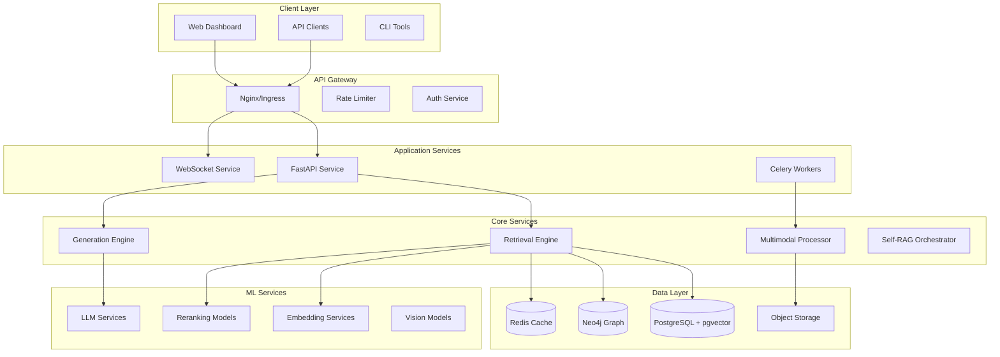

# Technical Architecture Guide - RAG Comprehensive System

## 🏗️ System Architecture Overview

### High-Level Architecture



## 🎯 Design Principles

### 1. Clean Architecture Layers

```python
# Domain Layer - Pure business logic, no dependencies
src/domain/
├── entities/          # Core business objects
├── value_objects/     # Immutable values
├── repositories/      # Abstract interfaces
├── services/          # Domain logic
└── events/           # Domain events

# Application Layer - Use cases and orchestration
src/application/
├── use_cases/        # Application-specific business rules
├── services/         # Application services
├── ports/            # Input/output interfaces
└── dtos/            # Data transfer objects

# Infrastructure Layer - External concerns
src/infrastructure/
├── persistence/      # Database implementations
├── external/         # Third-party integrations
├── messaging/        # Event/message handling
└── monitoring/       # Observability

# Presentation Layer - User interface
src/presentation/
├── api/             # REST/GraphQL endpoints
├── websocket/       # Real-time communication
└── cli/            # Command-line interface
```

### 2. Dependency Injection Pattern

```python
# src/presentation/api/dependencies.py
from dependency_injector import containers, providers
from dependency_injector.wiring import Provide, inject

class Container(containers.DeclarativeContainer):
    # Configuration
    config = providers.Configuration()
    
    # Infrastructure
    db_session = providers.Resource(
        get_db_session,
        db_url=config.database.url
    )
    
    redis_client = providers.Singleton(
        Redis.from_url,
        url=config.redis.url
    )
    
    # Repositories
    document_repository = providers.Factory(
        PostgreSQLDocumentRepository,
        session=db_session
    )
    
    vector_store = providers.Singleton(
        PgVectorStore,
        session=db_session
    )
    
    # Services
    embedding_service = providers.Singleton(
        OpenAIEmbeddingService,
        api_key=config.openai.api_key,
        model=config.openai.embedding_model
    )
    
    retrieval_service = providers.Factory(
        HybridRetrievalService,
        vector_store=vector_store,
        embedding_service=embedding_service
    )
    
    # Use Cases
    search_use_case = providers.Factory(
        SearchDocumentsUseCase,
        retrieval_service=retrieval_service,
        ranking_service=providers.Factory(MultiStageRankingService)
    )

# Usage in endpoints
@router.post("/search")
@inject
async def search(
    request: SearchRequest,
    use_case: SearchDocumentsUseCase = Provide[Container.search_use_case]
):
    return await use_case.execute(request)
```

### 3. Event-Driven Architecture

```python
# src/infrastructure/messaging/event_bus.py
from abc import ABC, abstractmethod
from typing import Dict, List, Type
import asyncio

class Event(ABC):
    """Base event class"""
    pass

class EventHandler(ABC):
    @abstractmethod
    async def handle(self, event: Event) -> None:
        pass

class EventBus:
    def __init__(self):
        self._handlers: Dict[Type[Event], List[EventHandler]] = {}
        self._queue = asyncio.Queue()
        self._running = False
    
    def register_handler(self, event_type: Type[Event], handler: EventHandler):
        if event_type not in self._handlers:
            self._handlers[event_type] = []
        self._handlers[event_type].append(handler)
    
    async def publish(self, event: Event):
        await self._queue.put(event)
        
        # Si no está corriendo, iniciar procesamiento
        if not self._running:
            asyncio.create_task(self._process_events())
    
    async def _process_events(self):
        self._running = True
        while not self._queue.empty():
            event = await self._queue.get()
            event_type = type(event)
            
            if event_type in self._handlers:
                # Ejecutar handlers en paralelo
                tasks = [
                    handler.handle(event) 
                    for handler in self._handlers[event_type]
                ]
                await asyncio.gather(*tasks, return_exceptions=True)
        
        self._running = False

# Domain event example
@dataclass
class DocumentProcessedEvent(Event):
    document_id: UUID
    chunks_created: int
    processing_time_ms: float

# Handler implementation
class DocumentIndexHandler(EventHandler):
    def __init__(self, search_index: SearchIndexService):
        self.search_index = search_index
    
    async def handle(self, event: DocumentProcessedEvent):
        await self.search_index.index_document(event.document_id)
```

## 🔄 Data Flow Architecture

### Document Ingestion Flow

```python
# 1. API receives document
@router.post("/documents")
async def upload_document(file: UploadFile, metadata: DocumentMetadata):
    # Validate file
    validate_file(file)
    
    # Store in object storage
    file_path = await object_storage.upload(file)
    
    # Create document entity
    document = Document.create(
        source=file_path,
        metadata=metadata.dict()
    )
    
    # Save to database
    await document_repository.save(document)
    
    # Trigger async processing
    await task_queue.enqueue(
        "process_document",
        document_id=document.id
    )
    
    return {"document_id": document.id, "status": "processing"}

# 2. Async worker processes document
@celery_app.task
async def process_document(document_id: UUID):
    document = await document_repository.get(document_id)
    
    # Parse content
    content = await parser_service.parse(document.source)
    
    # Extract metadata
    enhanced_metadata = await metadata_extractor.extract(content)
    
    # Create chunks
    chunks = await chunking_service.chunk(
        content,
        strategy="recursive",
        chunk_size=1000
    )
    
    # Generate embeddings
    embeddings = await embedding_service.embed_batch(
        [chunk.content for chunk in chunks]
    )
    
    # Store in vector database
    for chunk, embedding in zip(chunks, embeddings):
        await vector_store.upsert(
            chunk_id=chunk.id,
            embedding=embedding,
            metadata=chunk.metadata
        )
    
    # Update document status
    document.mark_as_processed()
    await document_repository.update(document)
    
    # Publish event
    await event_bus.publish(
        DocumentProcessedEvent(
            document_id=document.id,
            chunks_created=len(chunks)
        )
    )
```

### Retrieval Flow

```python
# Multi-stage retrieval pipeline
class RetrievalPipeline:
    def __init__(self, stages: List[RetrievalStage]):
        self.stages = stages
    
    async def retrieve(self, query: Query) -> RetrievalResult:
        # Initial candidates
        candidates = None
        metrics = {}
        
        for stage in self.stages:
            start_time = time.time()
            
            # Execute stage
            if candidates is None:
                # First stage - full retrieval
                candidates = await stage.retrieve(query)
            else:
                # Subsequent stages - rerank/filter
                candidates = await stage.process(query, candidates)
            
            # Collect metrics
            stage_time = time.time() - start_time
            metrics[stage.name] = {
                "duration_ms": stage_time * 1000,
                "candidates_in": len(candidates),
                "candidates_out": len(candidates)
            }
            
            # Early termination if needed
            if len(candidates) == 0:
                break
        
        return RetrievalResult(
            documents=candidates,
            metrics=metrics
        )

# Configure pipeline
retrieval_pipeline = RetrievalPipeline([
    SemanticRetrievalStage(vector_store, top_k=100),
    KeywordBoostStage(bm25_store, boost_factor=0.3),
    GraphExpansionStage(graph_store, max_hops=2),
    ColBERTRerankStage(colbert_model, top_k=20),
    CrossEncoderRerankStage(cross_encoder, top_k=10)
])
```

## 🏭 Infrastructure Patterns

### 1. Repository Pattern Implementation

```python
# Abstract repository
class Repository(ABC, Generic[T]):
    @abstractmethod
    async def get(self, id: UUID) -> Optional[T]:
        pass
    
    @abstractmethod
    async def save(self, entity: T) -> T:
        pass
    
    @abstractmethod
    async def delete(self, id: UUID) -> bool:
        pass

# Concrete implementation
class PostgreSQLRepository(Repository[T]):
    def __init__(self, session: AsyncSession, model_class: Type):
        self.session = session
        self.model_class = model_class
    
    async def get(self, id: UUID) -> Optional[T]:
        result = await self.session.execute(
            select(self.model_class).where(self.model_class.id == id)
        )
        model = result.scalar_one_or_none()
        return self._to_entity(model) if model else None
    
    async def save(self, entity: T) -> T:
        model = self._to_model(entity)
        self.session.add(model)
        await self.session.flush()
        return entity
    
    @abstractmethod
    def _to_entity(self, model) -> T:
        """Convert DB model to domain entity"""
        pass
    
    @abstractmethod
    def _to_model(self, entity: T):
        """Convert domain entity to DB model"""
        pass
```

### 2. Service Layer Pattern

```python
# Application service
class DocumentService:
    def __init__(self,
                 document_repo: DocumentRepository,
                 chunk_repo: ChunkRepository,
                 embedding_service: EmbeddingService,
                 vector_store: VectorStore):
        self.document_repo = document_repo
        self.chunk_repo = chunk_repo
        self.embedding_service = embedding_service
        self.vector_store = vector_store
    
    @transactional
    async def process_document(self, document: Document) -> ProcessingResult:
        try:
            # Business logic orchestration
            chunks = await self._create_chunks(document)
            embeddings = await self._generate_embeddings(chunks)
            await self._store_vectors(chunks, embeddings)
            
            document.mark_as_processed()
            await self.document_repo.update(document)
            
            return ProcessingResult(
                success=True,
                chunks_created=len(chunks)
            )
            
        except Exception as e:
            document.mark_as_failed(str(e))
            await self.document_repo.update(document)
            raise
```

### 3. CQRS Pattern

```python
# Command side
class CreateDocumentCommand:
    file_path: str
    metadata: dict

class CommandHandler:
    async def handle(self, command: CreateDocumentCommand) -> UUID:
        document = Document.create(
            source=command.file_path,
            metadata=command.metadata
        )
        await self.repository.save(document)
        await self.event_bus.publish(
            DocumentCreatedEvent(document.id)
        )
        return document.id

# Query side
class DocumentQueryService:
    def __init__(self, read_model: DocumentReadModel):
        self.read_model = read_model
    
    async def get_document_details(self, id: UUID) -> DocumentDTO:
        # Optimized read from denormalized view
        return await self.read_model.get_details(id)
    
    async def search_documents(self, 
                             query: str, 
                             filters: dict) -> List[DocumentSummaryDTO]:
        # Complex search across multiple indexes
        return await self.read_model.search(query, filters)
```

## 🔐 Security Architecture

### API Security Layers

```python
# 1. Authentication middleware
class JWTAuthMiddleware:
    def __init__(self, secret_key: str):
        self.secret_key = secret_key
    
    async def __call__(self, request: Request, call_next):
        # Extract token
        token = request.headers.get("Authorization", "").replace("Bearer ", "")
        
        if not token and request.url.path not in PUBLIC_ENDPOINTS:
            return JSONResponse(
                status_code=401,
                content={"error": "Missing authentication"}
            )
        
        try:
            # Verify token
            payload = jwt.decode(token, self.secret_key, algorithms=["HS256"])
            request.state.user = payload
        except jwt.InvalidTokenError:
            return JSONResponse(
                status_code=401,
                content={"error": "Invalid token"}
            )
        
        response = await call_next(request)
        return response

# 2. Rate limiting
@limiter.limit("100/minute")
@router.post("/search")
async def search(request: Request, query: SearchQuery):
    return await search_service.search(query)

# 3. Input validation
class SearchQuery(BaseModel):
    text: str = Field(..., min_length=1, max_length=1000)
    max_results: int = Field(10, ge=1, le=100)
    filters: Dict[str, Any] = Field(default_factory=dict)
    
    @validator('text')
    def sanitize_text(cls, v):
        # Remove potential injection patterns
        return v.strip().replace('\x00', '')
```

## 🎛️ Configuration Management

### Environment-based Configuration

```python
# src/config/settings.py
from pydantic import BaseSettings, validator
from typing import Optional, List

class Settings(BaseSettings):
    # Environment
    environment: str = "development"
    debug: bool = False
    
    # API Configuration
    api_host: str = "0.0.0.0"
    api_port: int = 8000
    api_prefix: str = "/api/v1"
    
    # Database
    database_url: str
    database_pool_size: int = 20
    database_max_overflow: int = 40
    
    # Redis
    redis_url: str = "redis://localhost:6379"
    redis_ttl: int = 3600
    
    # ML Models
    embedding_model: str = "text-embedding-3-large"
    reranking_model: str = "cross-encoder/ms-marco-MiniLM-L-12-v2"
    llm_model: str = "gpt-4"
    
    # Features
    enable_multimodal: bool = True
    enable_self_rag: bool = True
    enable_graph_rag: bool = True
    
    @validator('database_url')
    def validate_database_url(cls, v):
        if not v.startswith('postgresql'):
            raise ValueError('Database URL must be PostgreSQL')
        return v
    
    class Config:
        env_file = ".env"
        env_file_encoding = "utf-8"
        case_sensitive = False

# Load settings
settings = Settings()

# Environment-specific overrides
if settings.environment == "production":
    settings.debug = False
    settings.database_pool_size = 50
```

## 📊 Performance Optimization Strategies

### 1. Caching Architecture

```
┌─────────────┐     ┌─────────────┐     ┌─────────────┐
│   Browser   │────▶│  CDN Cache  │────▶│   Nginx     │
│   Cache     │     │  (Static)   │     │   Cache     │
└─────────────┘     └─────────────┘     └─────────────┘
                                               │
                                               ▼
                                        ┌─────────────┐
                                        │  App Cache  │
                                        │ (In-Memory) │
                                        └─────────────┘
                                               │
                                               ▼
                                        ┌─────────────┐
                                        │Redis Cache  │
                                        │(Distributed)│
                                        └─────────────┘
                                               │
                                               ▼
                                        ┌─────────────┐
                                        │  Database   │
                                        │   Cache     │
                                        └─────────────┘
```

### 2. Async Processing Patterns

```python
# Concurrent processing with semaphore
class ConcurrentProcessor:
    def __init__(self, max_concurrent: int = 10):
        self.semaphore = asyncio.Semaphore(max_concurrent)
    
    async def process_batch(self, items: List[Any], processor_func):
        async def process_with_limit(item):
            async with self.semaphore:
                return await processor_func(item)
        
        tasks = [process_with_limit(item) for item in items]
        return await asyncio.gather(*tasks, return_exceptions=True)

# Background task queue
class TaskQueue:
    def __init__(self, redis_client: Redis):
        self.redis = redis_client
        self.queue_key = "task_queue"
    
    async def enqueue(self, task_type: str, **kwargs):
        task = {
            "type": task_type,
            "id": str(uuid4()),
            "created_at": datetime.utcnow().isoformat(),
            "params": kwargs
        }
        await self.redis.lpush(self.queue_key, json.dumps(task))
    
    async def dequeue(self) -> Optional[dict]:
        task_data = await self.redis.rpop(self.queue_key)
        return json.loads(task_data) if task_data else None
```

## 🔍 Monitoring & Observability

### Distributed Tracing

```python
# OpenTelemetry instrumentation
from opentelemetry import trace
from opentelemetry.instrumentation.fastapi import FastAPIInstrumentor
from opentelemetry.instrumentation.sqlalchemy import SQLAlchemyInstrumentor

# Auto-instrument FastAPI
FastAPIInstrumentor.instrument_app(app)

# Auto-instrument SQLAlchemy
SQLAlchemyInstrumentor().instrument(
    engine=engine,
    service="rag-system"
)

# Manual instrumentation
tracer = trace.get_tracer(__name__)

class TracedService:
    @trace_method
    async def process_query(self, query: str):
        with tracer.start_as_current_span("process_query") as span:
            span.set_attribute("query.text", query[:100])
            span.set_attribute("query.length", len(query))
            
            # Retrieval phase
            with tracer.start_as_current_span("retrieval"):
                documents = await self.retrieve(query)
                span.set_attribute("documents.count", len(documents))
            
            # Generation phase
            with tracer.start_as_current_span("generation"):
                response = await self.generate(query, documents)
                span.set_attribute("response.length", len(response))
            
            return response
```

### Health Checks

```python
# src/presentation/api/health.py
from enum import Enum

class HealthStatus(str, Enum):
    HEALTHY = "healthy"
    DEGRADED = "degraded"
    UNHEALTHY = "unhealthy"

@router.get("/health")
async def health_check():
    checks = {
        "database": await check_database(),
        "redis": await check_redis(),
        "vector_store": await check_vector_store(),
        "ml_services": await check_ml_services()
    }
    
    # Overall status
    if all(check["status"] == "healthy" for check in checks.values()):
        overall_status = HealthStatus.HEALTHY
    elif any(check["status"] == "unhealthy" for check in checks.values()):
        overall_status = HealthStatus.UNHEALTHY
    else:
        overall_status = HealthStatus.DEGRADED
    
    return {
        "status": overall_status,
        "checks": checks,
        "timestamp": datetime.utcnow().isoformat()
    }

async def check_database() -> dict:
    try:
        async with get_db_context() as db:
            await db.execute("SELECT 1")
        return {"status": "healthy", "latency_ms": 5}
    except Exception as e:
        return {"status": "unhealthy", "error": str(e)}
```